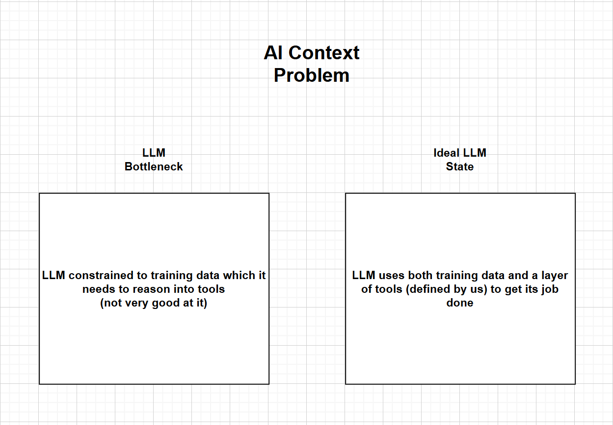
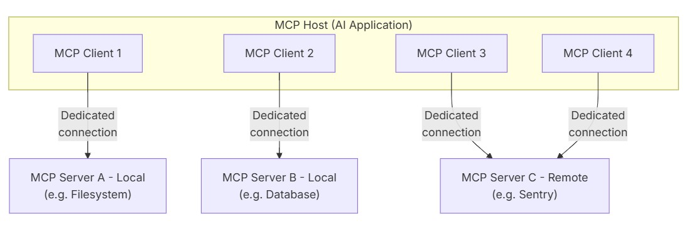
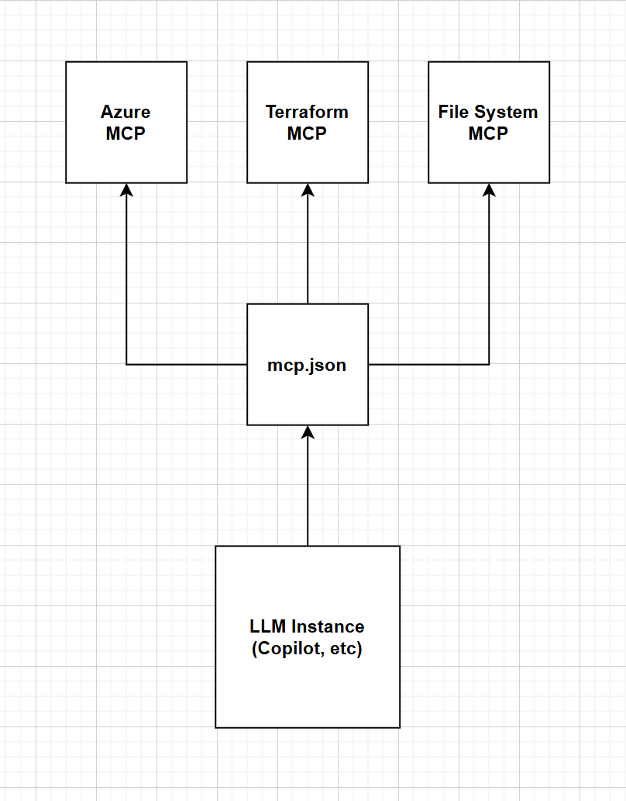
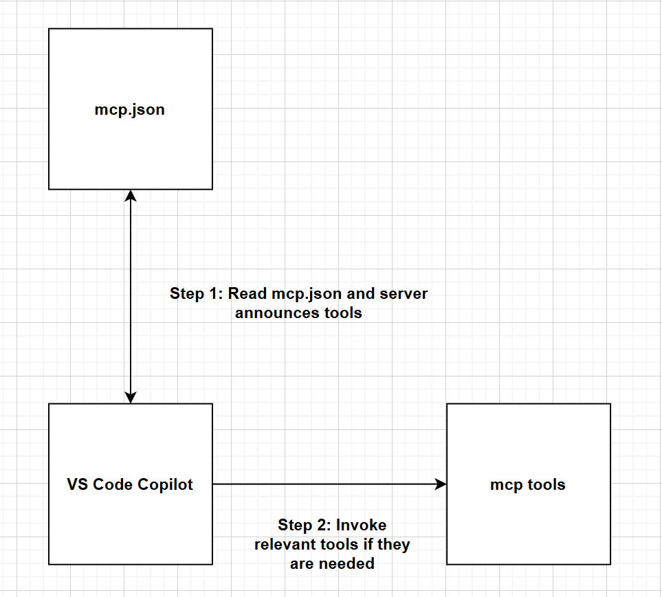
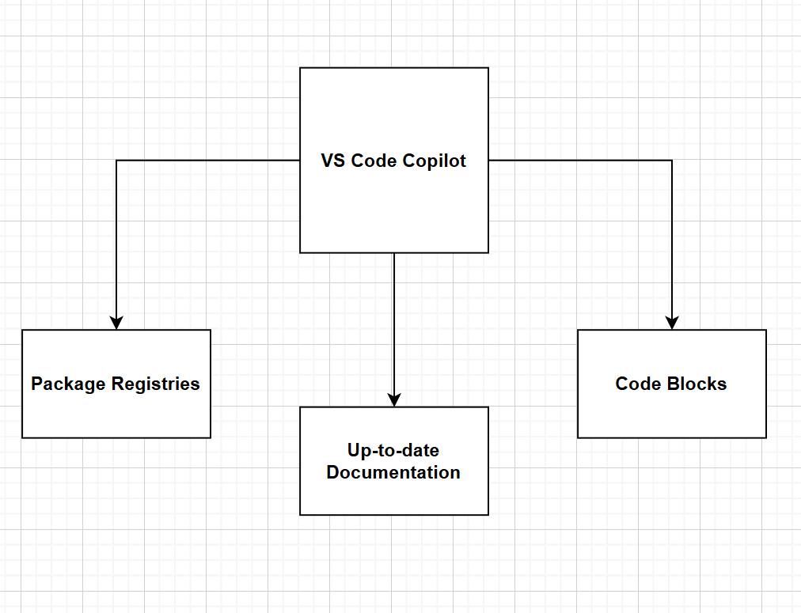

# Context Is the Feature: MCP + GitHub Copilot


## The AI Context Problem

### How LLMs Work
- **Token-based processing:** Every word, character, and code symbol is converted into tokens
- **Context window:** Limited memory that constrains what the model can "see" at once
- **Training data cutoff:** Models are trained on data up to a specific date

### The Stale Knowledge Problem
- **Outdated package versions:** LLM suggests `azurerm` provider 3.x when 4.x is current
- **Missing new features:** Doesn't know about services or capabilities released after training
- **No awareness of YOUR environment:** Can't see your actual Azure resources, git history, or local files

<!-- **Example scenario:**
```
You: "Create Terraform for an Azure Container App"
LLM (without MCP): Suggests outdated module patterns from 2023
LLM (with MCP): Queries Terraform registry for latest provider version,
                 checks your Azure subscription for existing resources,
                 uses current best practices
``` -->



---

## What is MCP?

### Model Context Protocol
- **"USB-C for AI"** — standardized protocol for AI-tool integration
- **Open standard** by Anthropic (now widely adopted)
- **Purpose:** Give LLMs secure, structured access to external tools and real-time data

### MCP - Participants
- **MCP Host**: The AI application that coordinates and manages one or multiple MCP clients
- **MCP Client**: A component that maintains a connection to an MCP server and obtains context from an MCP server for the MCP host to use
- **MCP Server**: A program that provides context to MCP clients




### MCP Integration with LLMs
- **Simple JSON configuration:** One `mcp.json` file defines all your tool integrations
- **Native VS Code integration:** MCP servers run as background processes managed by VS Code
- **Standard protocol:** Any MCP-compliant server works with Copilot—no custom integrations needed



---

## MCP Architecture

### The Protocol: Request/Response Communication

MCP uses **JSON-RPC 2.0** for communication between Copilot and MCP servers.

**Basic flow:**
```json
// Copilot sends request
{
  "jsonrpc": "2.0",
  "id": 1,
  "method": "tools/call",
  "params": {
    "name": "azure_list_storage_accounts",
    "arguments": {
      "resourceGroup": "my-rg"
    }
  }
}

// MCP Server responds
{
  "jsonrpc": "2.0",
  "id": 1,
  "result": {
    "content": [
      {"name": "mystorageacct1", "sku": "Standard_LRS"},
      {"name": "mystorageacct2", "sku": "Premium_LRS"}
    ]
  }
}
```

### Three Core Capabilities

**1. Tools** — Functions the AI can invoke
```json
// Azure MCP: Query live cloud resources
{
  "name": "azure_list_storage_accounts",
  "description": "List all storage accounts in a resource group or subscription",
  "inputSchema": {
    "type": "object",
    "properties": {
      "resourceGroup": {"type": "string", "description": "Resource group name (optional)"}
    }
  }
}
```
**What this does:** Copilot can query your actual Azure subscription to see real resources instead of guessing or using placeholder values.

---

**2. Resources** — Data the AI can read  
```json
// Git MCP: Access repository history
{
  "uri": "git://log",
  "name": "Git commit history",
  "description": "Recent commits with author, date, and message",
  "mimeType": "application/json"
}
```
**What this does:** Copilot can read your git history to understand code evolution, find who changed what, and provide context-aware suggestions based on past commits.

---

**3. Prompts** — Pre-built templates for common workflows  
```json
// AVM MCP: Validate against Azure standards
{
  "name": "validate_azure_module",
  "description": "Check if infrastructure code follows Azure Verified Module patterns",
  "arguments": [
    {"name": "module_path", "description": "Path to Bicep/Terraform module"}
  ]
}
```
**What this does:** Copilot can use pre-configured compliance checks to ensure your infrastructure follows enterprise standards without you having to specify the rules each time.

---

## Copilot Integration

### How Copilot Discovers MCP Tools

1. **Startup:** VS Code reads `mcp.json` and spawns MCP server processes
2. **Tool discovery:** Each server announces available tools/resources to Copilot
3. **Intelligent routing:** Copilot analyzes your question, invokes relevant tools, and synthesizes results

### Tool Visibility in Agent Mode
- **Chat interface:** Copilot shows which MCP tools it's using
  - Example: `Using azure MCP to query storage accounts...`
- **Explicit invocation:** You can ask: `"Use the terraform MCP to find the latest azurerm provider version"`
- **Implicit invocation:** Copilot automatically selects tools based on context



---

<!-- ## Where MCPs Live -->
<!-- 
### Configuration File Location
- **Path (Windows):** `%APPDATA%\Code\User\mcp.json`
  - Full path: `C:\Users\<username>\AppData\Roaming\Code\User\mcp.json`
- **Format:** JSON configuration with server definitions -->
<!-- 
### Sharing MCP Configurations with Your Team -->

<!-- **Option 1: Workspace Settings (Recommended)**
- Create `.vscode/mcp.json` in your repository root
- Commit to git → everyone on the team gets the same MCP servers
- Override user-level settings for project-specific tools

**Option 2: Setup Scripts**
- Distribute a script (like `setup_mcp_servers.ps1`) in your repo
- Team members run it once to configure their local environment
- Automatically writes `mcp.json` to user directory

**Option 3: Documentation + Manual Config**
- Document required MCP servers in README
- Team members copy example `mcp.json` to their user directory
- Less automated but gives users full control

**Best practice for enterprise teams:**
```
repo/
├── .vscode/
│   └── mcp.json          # Team-shared MCP configuration
├── scripts/
│   └── setup-mcp.ps1     # Automated setup script
└── docs/
    └── mcp-guide.md      # Documentation for team
``` -->

<!-- ### Example Configuration Structure
```json
{
  "servers": {
    "azure": {
      "type": "stdio",
      "command": "azmcp",
      "args": ["server", "start", "--transport=stdio"]
    },
    "terraform": {
      "type": "stdio",
      "command": "docker",
      "args": ["run", "-i", "--rm", "hashicorp/terraform-mcp-server"]
    }
  }
}
``` -->

## MCP Server Types

MCP servers come in different packages depending on your needs:

**npm packages** — Community-built tools (e.g., filesystem access)  
**Docker containers** — Vendor tools with dependencies (e.g., Terraform registry)  
**Python (uvx)** — Lightweight automation tools (e.g., git operations)  
**Node.js CLI** — Cloud service integrations (e.g., Azure MCP)  
**VS Code extensions** — Automatic integration (e.g., Bicep validation)

### MCPs in Our Setup Script
| MCP Server | Purpose | Type |
|------------|---------|------|
| **terraform** | Terraform registry, provider schemas, module search | Docker |
| **azure** | Azure resource management, queries, deployments | npm CLI |
| **avm** | Azure Verified Modules catalog and compliance | Python (uvx) |
| **filesystem** | Read/write access to local directories | npm |
| **fetch** | Web content fetching (docs, APIs) | Python (uvx) |
| **git** | Git operations (status, diff, commit, blame) | Python (uvx) |
| **bicep** | Bicep template validation, schema lookup | VS Code Extension |

---

## Real-World Value

**Live data access** — Query actual Azure resources, git history, and file systems  
**Current standards** — Latest Terraform providers, Azure Verified Modules, Bicep schemas  
**Unified workflow** — Multi-system orchestration in a single conversation



---

## MCP Performance & Limitations

### The Context Consumption Problem

**Every MCP tool call consumes context window tokens:**
- Tool invocation request: ~50-200 tokens
- Tool response data: 500-5,000 tokens (varies by response size)
- Multiple tool calls compound quickly

<!-- **Example scenario:**
```
You: "Review my infrastructure across 5 Azure resource groups"
Copilot invokes:
  - azure MCP: list_resource_groups (500 tokens)
  - azure MCP: get_resources for each group (2,000 tokens × 5 = 10,000 tokens)
  - bicep MCP: validate 10 template files (3,000 tokens)
  Total consumed: ~13,500 tokens before generating response
``` -->

<!-- **Impact on conversation:**
- Fewer tokens available for Copilot's response
- May need to truncate earlier conversation history
- Complex queries can hit context limits -->

### Latency Overhead

**Each MCP call adds execution time:**
- **Fast tools** (filesystem, git): 10-100ms per call
- **Medium tools** (terraform registry): 200-500ms per call  
- **Slow tools** (Azure API with large result sets): 1-5 seconds per call

<!-- **Compound latency example:**
```
Query: "Update all storage accounts to use private endpoints"
  1. List storage accounts (2 sec)
  2. Get each account's network config (0.5 sec × 10 = 5 sec)
  3. Check virtual network topology (3 sec)
  4. Generate updated Bicep (Copilot processing)
  Total wait time: ~10+ seconds before you see a response
```

**User experience impact:**
- Longer wait times for complex queries
- Users may think Copilot is "stuck"
- Need to balance thoroughness vs. speed -->

### Best Practices to Mitigate Issues

**1. Be selective with MCP servers**
- Only configure MCPs you use regularly
- Disable unused servers in workspace settings
- Create project-specific configurations (.vscode/mcp.json)

**2. Scope your questions appropriately**
- ❌ "Audit all 500 resources in my subscription"
- ✅ "Audit storage accounts in my dev resource group"

**3. Workspace-specific configurations**
```
Infrastructure projects → Enable: azure, terraform, bicep MCPs
Backend APIs → Enable: git, filesystem MCPs only
Frontend projects → Minimal or no MCPs
```

---

## Live Demo

**Setup:** Show Copilot WITH and WITHOUT MCP to prove the difference

### Part 1: The Problem (Without MCP)
Disable MCP servers temporarily, then ask:  

*"What's the latest azurerm Terraform provider version?"*

- Result: Outdated/vague answer from training data

### Part 2: The Solution (With MCP)
Re-enable MCP servers, ask the SAME question:  

*"What's the latest azurerm Terraform provider version?"*

- Watch for: `Using terraform MCP...`
- Result: Live registry data with current version number

### Part 3: The Power (Orchestration)
*"List my Azure resource groups in the Connectivity subscription of my tenant \"<tenant-id>\", create a Python script to query them, and commit it with a good message"*

- Watch for: Azure MCP → Git MCP working together
- Result: End-to-end workflow in one conversation

**Why this works:** Parts 1-2 prove the stale data problem. Part 3 shows multi-system orchestration.

---

## Setup Instructions

### Prerequisites
- Docker Desktop
- Azure CLI (`az` command)
- Node.js (for `npx` and `npm`)
- uv (Python package manager): [Install guide](https://docs.astral.sh/uv/)

### Quick Start
Run the setup script:
```powershell
.\setup_mcp_servers.ps1 -TenantId "<your-azure-tenant-id>"
```

### What the Script Does
1. Installs MCP server tools (`azmcp`, Docker image, Python packages)
2. Logs into Azure and verifies installations
3. Writes `mcp.json` config with 7 MCP servers to `%APPDATA%\Code\User\mcp.json`

### Post-Setup
- **Restart VS Code** for MCP servers to activate
- **Verify in Copilot:** Type `@workspace /help` and look for MCP-provided tools
---
