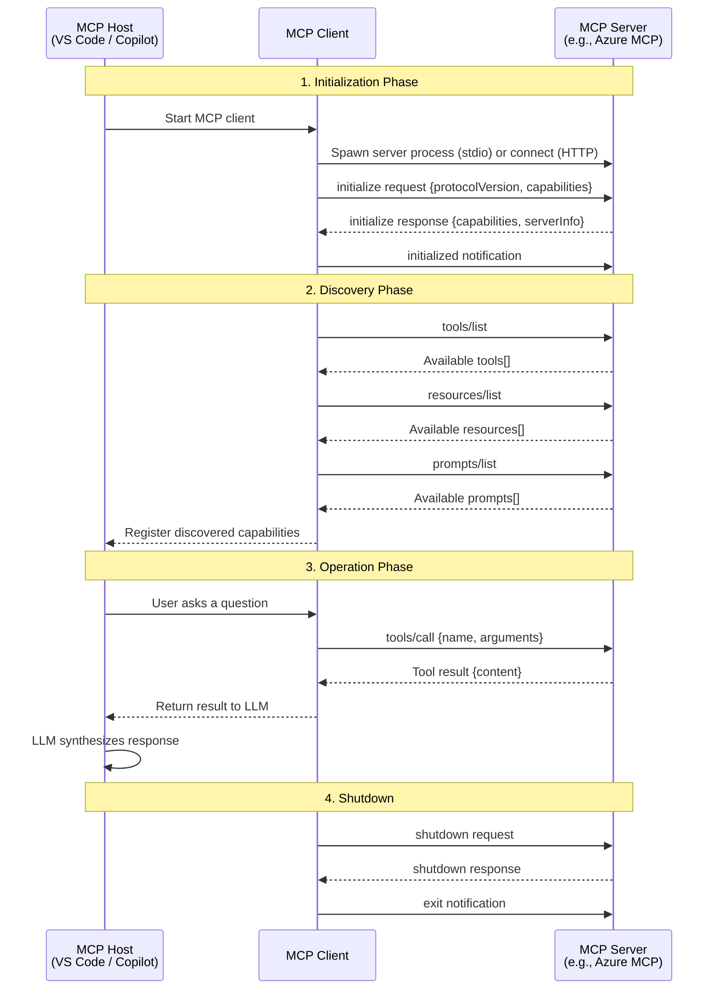

# Context Is the Feature: MCP + GitHub Copilot

## Table of Contents

- [The AI Context Problem](#the-ai-context-problem)
- [What is MCP?](#what-is-mcp)
- [MCP Architecture](#mcp-architecture)
- [MCP Server Types](#mcp-server-types)
- [MCP Transport](#mcp-transport)
- [Building Your Own MCP Server](#building-your-own-mcp-server)
- [Copilot Integration](#copilot-integration)
- [Real-World Value](#real-world-value)
- [Configuration of MCP within GitHub Copilot: Available Policies](#configuration-of-mcp-within-github-copilot-available-policies)
- [MCP Registry](#3-mcp-registry)
- [Purpose of MCP Registry](#4-purpose-of-mcp-registry)
- [Creating an MCP Registry](#5-creating-an-mcp-registry)
- [MCP Performance & Limitations](#mcp-performance--limitations)
- [Live Demo](#live-demo)
- [Setup Instructions](#setup-instructions)

---

## The AI Context Problem

### How LLMs Work
- **Token-based processing:** Every word, character, and code symbol is converted into tokens
- **Context window:** Limited memory that constrains what the model can "see" at once
- **Training data cutoff:** Models are trained on data up to a specific date

### The Stale Knowledge Problem
- **Outdated package versions:** LLM suggests `azurerm` provider 3.x when 4.x is current
- **Missing new features:** Doesn't know about services or capabilities released after training
- **No awareness of YOUR environment:** Can't see your actual Azure resources, git history, or local files

<!-- **Example scenario:**
```
You: "Create Terraform for an Azure Container App"
LLM (without MCP): Suggests outdated module patterns from 2023
LLM (with MCP): Queries Terraform registry for latest provider version,
                 checks your Azure subscription for existing resources,
                 uses current best practices
``` -->


---

## What is MCP?

### Model Context Protocol
- **"USB-C for AI"** — standardized protocol for AI-tool integration
- **Open standard** by Anthropic (now widely adopted)
- **Purpose:** Give LLMs secure, structured access to external tools and real-time data

### MCP - Participants
- **MCP Host**: The AI application that coordinates and manages one or multiple MCP clients
- **MCP Client**: A component that maintains a connection to an MCP server and obtains context from an MCP server for the MCP host to use
- **MCP Server**: A program that provides context to MCP clients


### MCP Integration with LLMs
- **Simple JSON configuration:** One `mcp.json` file defines all your tool integrations
- **Native VS Code integration:** MCP servers run as background processes managed by VS Code
- **Standard protocol:** Any MCP-compliant server works with Copilot—no custom integrations needed


---

## MCP Architecture

### Architecture Overview

MCP follows a **client-server architecture** where the communication passes through four distinct phases: initialization, discovery, operation, and shutdown. Understanding this lifecycle is key to understanding how Copilot works with MCP servers.



### Protocol Lifecycle

**1. Initialization** — The host launches the MCP client, which spawns (stdio) or connects to (HTTP) the server. They exchange an `initialize` handshake to agree on the protocol version and declare their respective capabilities.

**2. Discovery** — The client queries the server for its available tools, resources, and prompts. The server responds with metadata (names, descriptions, input schemas) so the host knows what the server can do.

**3. Operation** — During normal use, the host routes user requests to the appropriate server. The client sends JSON-RPC calls (e.g., `tools/call`) and the server returns results. Multiple calls can happen throughout a session.

**4. Shutdown** — When the session ends, the client sends a `shutdown` request followed by an `exit` notification. For stdio servers, the process terminates; for HTTP servers, the session is closed.

### The Protocol: Request/Response Communication

MCP uses **JSON-RPC 2.0** for communication between Copilot and MCP servers.

**Basic flow:**
```json
// Copilot sends request
{
  "jsonrpc": "2.0",
  "id": 1,
  "method": "tools/call",
  "params": {
    "name": "azure_list_storage_accounts",
    "arguments": {
      "resourceGroup": "my-rg"
    }
  }
}

// MCP Server responds
{
  "jsonrpc": "2.0",
  "id": 1,
  "result": {
    "content": [
      {"name": "mystorageacct1", "sku": "Standard_LRS"},
      {"name": "mystorageacct2", "sku": "Premium_LRS"}
    ]
  }
}
```

### Three Core Capabilities

**1. Tools** — Functions the AI can invoke. Executable functions that AI applications can invoke to perform actions (e.g., file operations, API calls, database queries)
```json
// Azure MCP: Query live cloud resources
{
  "name": "azure_list_storage_accounts",
  "description": "List all storage accounts in a resource group or subscription",
  "inputSchema": {
    "type": "object",
    "properties": {
      "resourceGroup": {"type": "string", "description": "Resource group name (optional)"}
    }
  }
}
```
**What this does:** Copilot can query your actual Azure subscription to see real resources instead of guessing or using placeholder values.

---

**2. Resources** — Data the AI can read. Data sources that provide contextual information to AI applications (e.g., file contents, database records, API responses)  
```json
// Git MCP: Access repository history
{
  "uri": "git://log",
  "name": "Git commit history",
  "description": "Recent commits with author, date, and message",
  "mimeType": "application/json"
}
```
**What this does:** Copilot can read your git history to understand code evolution, find who changed what, and provide context-aware suggestions based on past commits.

---

**3. Prompts** — Pre-built templates for common workflows. Reusable templates that help structure interactions with language models (e.g., system prompts, few-shot examples)  
```json
// AVM MCP: Validate against Azure standards
{
  "name": "validate_azure_module",
  "description": "Check if infrastructure code follows Azure Verified Module patterns",
  "arguments": [
    {"name": "module_path", "description": "Path to Bicep/Terraform module"}
  ]
}
```
**What this does:** Copilot can use pre-configured compliance checks to ensure your infrastructure follows enterprise standards without you having to specify the rules each time.

---

## MCP Server Types

MCP servers come in different packages depending on your needs:

**npm packages** — Community-built tools (e.g., filesystem access)  
**Docker containers** — Vendor tools with dependencies (e.g., Terraform registry)  
**Python (uvx)** — Lightweight automation tools (e.g., git operations)  
**Node.js CLI** — Cloud service integrations (e.g., Azure MCP)  
**VS Code extensions** — Automatic integration (e.g., Bicep validation)

---

## MCP Transport

The **transport layer** defines how MCP clients and servers communicate — it is the underlying mechanism that carries JSON-RPC 2.0 messages between them. Choosing the right transport determines whether your server runs locally alongside the IDE, or remotely over HTTP.

### Why Transport Matters

MCP separates the protocol (what messages look like) from the transport (how messages are delivered). This means the same server logic can run over different transports depending on the deployment scenario — local development, shared team server, or cloud-hosted service.

### Transport Options

MCP defines three transport mechanisms:

#### 1. stdio (Standard Input/Output)

The client spawns the MCP server as a **child process** and communicates by writing JSON-RPC messages to the server's **stdin** and reading responses from its **stdout**.

**How it works:**
- The MCP host (e.g., VS Code) launches the server process using the configured `command` and `args`
- Messages are sent line-by-line over stdin/stdout
- The server lifecycle is tied to the client — when the client stops, the server process exits

**Configuration example:**
```json
{
  "servers": {
    "my-server": {
      "type": "stdio",
      "command": "python",
      "args": ["my_server.py"]
    }
  }
}
```

**Best for:** Local IDE integrations, CLI tools, single-user workflows  
**Advantages:** Simple setup, no networking required, process isolation, no authentication needed  
**Limitations:** Only local — the server must run on the same machine as the client

---

#### 2. Streamable HTTP

The current recommended HTTP transport. The client communicates with the server over a single HTTP endpoint using **POST** requests, and the server can optionally upgrade responses to **Server-Sent Events (SSE)** streams for real-time delivery.

**How it works:**
- The client sends JSON-RPC requests via `POST` to the server's endpoint (e.g., `http://localhost:3000/mcp`)
- For simple request/response, the server replies with `Content-Type: application/json`
- For streaming or server-initiated messages, the server responds with `Content-Type: text/event-stream` (SSE)
- The server can optionally support a `GET` request on the same endpoint to open a standalone SSE stream for server-initiated notifications
- Session management is handled via the `Mcp-Session-Id` header

**Configuration example:**
```json
{
  "servers": {
    "remote-server": {
      "type": "http",
      "url": "https://my-mcp-server.example.com/mcp"
    }
  }
}
```

**Best for:** Remote/shared servers, multi-user environments, cloud-hosted MCP services  
**Advantages:** Works over the network, supports authentication headers, stateless-friendly, firewall-compatible (standard HTTP)  
**Limitations:** Requires HTTP server infrastructure, more complex to deploy than stdio

### Transport Comparison

| Criteria | stdio | Streamable HTTP |
|---|---|---|
| **Deployment** | Local only | Local or remote |
| **Networking** | None required | HTTP/HTTPS |
| **Multi-user** | Single user | Multiple users |
| **Authentication** | Not needed (local process) | HTTP headers / tokens |
| **Streaming support** | Inherent (continuous stdin/stdout) | Optional SSE upgrade |
| **Session management** | Implicit (process lifetime) | `Mcp-Session-Id` header |
| **Complexity** | Low | Medium |
| **VS Code support** | Fully supported | Fully supported |

### Choosing a Transport

- **Building a local tool** for personal or single-machine use → **stdio**
- **Building a shared/remote server** for teams or cloud deployment → **Streamable HTTP**

---

## Building Your Own MCP Server

While many pre-built MCP servers exist, you may need to build a custom one to expose your own APIs, internal tools, or proprietary data sources to GitHub Copilot. The **Model Context Protocol SDKs** make this straightforward.

### The MCP SDKs

Anthropic and the community maintain official SDKs for building MCP servers (and clients) in multiple languages:

| Language | SDK Repository | Package |
|---|---|---|
| **TypeScript/Node.js** | [modelcontextprotocol/typescript-sdk](https://github.com/modelcontextprotocol/typescript-sdk) | `@modelcontextprotocol/sdk` (npm) |
| **Python** | [modelcontextprotocol/python-sdk](https://github.com/modelcontextprotocol/python-sdk) | `mcp` (PyPI) |
| **Java/Kotlin** | [modelcontextprotocol/java-sdk](https://github.com/modelcontextprotocol/java-sdk) | `io.modelcontextprotocol:sdk` (Maven) |
| **C#/.NET** | [modelcontextprotocol/csharp-sdk](https://github.com/modelcontextprotocol/csharp-sdk) | `ModelContextProtocol` (NuGet) |

### Minimal Example: Python MCP Server

A basic MCP server that exposes a single tool using the Python SDK:

```python
from mcp.server.fastmcp import FastMCP

mcp = FastMCP("my-tool-server")

@mcp.tool()
def get_greeting(name: str) -> str:
    """Return a greeting for the given name."""
    return f"Hello, {name}! Welcome to MCP."

if __name__ == "__main__":
    mcp.run(transport="stdio")
```

### Minimal Example: TypeScript MCP Server

The same concept using the TypeScript SDK:

```typescript
import { McpServer } from "@modelcontextprotocol/sdk/server/mcp.js";
import { StdioServerTransport } from "@modelcontextprotocol/sdk/server/stdio.js";
import { z } from "zod";

const server = new McpServer({ name: "my-tool-server", version: "1.0.0" });

server.tool("get_greeting", { name: z.string() }, async ({ name }) => ({
  content: [{ type: "text", text: `Hello, ${name}! Welcome to MCP.` }],
}));

const transport = new StdioServerTransport();
await server.connect(transport);
```

### Key Concepts When Building

1. **Transport:** Choose the right transport for your deployment — see the [MCP Transport](#mcp-transport) section above for a full comparison of stdio, Streamable HTTP, and SSE.
2. **Tools:** Functions the AI can call — define a name, input schema, and handler function.
3. **Resources:** Read-only data endpoints the AI can query — useful for exposing documents, configs, or database records.
4. **Prompts:** Reusable prompt templates the AI can use for structured workflows.

### Registering Your Server with VS Code

Once built, add your server to `.vscode/mcp.json` (workspace) or `%APPDATA%\Code\User\mcp.json` (user-level):

```json
{
  "servers": {
    "my-tool-server": {
      "type": "stdio",
      "command": "python",
      "args": ["path/to/my_server.py"]
    }
  }
}
```

### Official Documentation & Specification

- **MCP Specification:** [spec.modelcontextprotocol.io](https://spec.modelcontextprotocol.io/) — the full protocol reference
- **MCP Documentation:** [modelcontextprotocol.io](https://modelcontextprotocol.io/) — guides, tutorials, and quickstarts
- **MCP GitHub Organization:** [github.com/modelcontextprotocol](https://github.com/modelcontextprotocol) — all official repositories

### Community Examples on GitHub

The community has built hundreds of MCP servers that serve as practical references:

| Example Server | Description | Link |
|---|---|---|
| **MCP Servers (Official)** | Collection of reference server implementations maintained by the MCP team | [modelcontextprotocol/servers](https://github.com/modelcontextprotocol/servers) |
| **Awesome MCP Servers** | Community-curated list of MCP servers across categories | [punkpeye/awesome-mcp-servers](https://github.com/punkpeye/awesome-mcp-servers) |
| **Playwright MCP** | Browser automation and web scraping via Playwright | [microsoft/playwright-mcp](https://github.com/microsoft/playwright-mcp) |
| **GitHub MCP Server** | Access GitHub APIs for repos, issues, PRs, and more | [github/github-mcp-server](https://github.com/github/github-mcp-server) |
| **Azure MCP Server** | Query and manage Azure resources | [Azure/azure-mcp](https://github.com/Azure/azure-mcp) |
| **Terraform MCP Server** | Terraform registry and module lookups | [hashicorp/terraform-mcp-server](https://github.com/hashicorp/terraform-mcp-server) |
| **Filesystem MCP Server** | Secure local file system access | [modelcontextprotocol/servers (filesystem)](https://github.com/modelcontextprotocol/servers/tree/main/src/filesystem) |

> **Tip:** Browse the [modelcontextprotocol/servers](https://github.com/modelcontextprotocol/servers) repository for well-structured reference implementations when starting your own server. The official examples cover tools, resources, and prompts patterns you can adapt.

---

## Copilot Integration

### How Copilot Discovers MCP Tools

1. **Startup:** VS Code reads `mcp.json` and spawns MCP server processes
2. **Tool discovery:** Each server announces available tools/resources to Copilot
3. **Intelligent routing:** Copilot analyzes your question, invokes relevant tools, and synthesizes results

### Tool Visibility in Agent Mode
- **Chat interface:** Copilot shows which MCP tools it's using
  - Example: `Using azure MCP to query storage accounts...`
- **Explicit invocation:** You can ask: `"Use the terraform MCP to find the latest azurerm provider version"`
- **Implicit invocation:** Copilot automatically selects tools based on context


---

## Real-World Value

**Live data access** — Query actual Azure resources, git history, and file systems  
**Current standards** — Latest Terraform providers, Azure Verified Modules, Bicep schemas  
**Unified workflow** — Multi-system orchestration in a single conversation


---

## Configuration of MCP within GitHub Copilot: Available Policies

GitHub provides three policy settings on **GitHub.com** that let enterprise owners and organization owners control MCP server discovery and access:

| Policy Setting | Description |
|---|---|
| **MCP servers in Copilot** | Master switch that manages the use of MCP servers for all users with Copilot seats in your organization or enterprise. You can allow or block MCP server usage entirely. |
| **MCP Registry URL** | Specifies the URL of your MCP registry, allowing your developers to discover and use approved MCP servers in supported IDEs and surfaces. |
| **Restrict MCP access to registry servers** | Controls whether developers can use **any** MCP server or are restricted to **only** those listed in the configured registry (allowlist enforcement). |

### Supported Surfaces

MCP management features (registry discovery and allowlist enforcement) are supported in the following IDEs:

| Surface | Registry Discovery | Allowlist Enforcement |
|---|---|---|
| VS Code | Supported | Supported |
| VS Code Insiders | Supported | Supported |
| Visual Studio | Supported | Supported |
| JetBrains IDEs | Supported | Supported |
| Eclipse | Supported | Supported |
| Xcode | Supported | Supported |
| Copilot CLI | Not supported | Not supported |
| Copilot cloud agent | Not supported | Not supported |

> **Note:** For Eclipse, JetBrains, and Xcode, MCP management features are supported in the pre-release versions of Copilot.

---

## 3. MCP Registry

An **MCP registry** is a directory (catalog) of MCP servers that acts as a discovery mechanism for IDEs and GitHub Copilot. Each registry entry points to a server's **manifest**, which describes the tools, resources, and prompts that server provides.

Think of it as an "app store" for MCP servers — a centralized place where approved servers are listed, versioned, and described so that developers can find and use them without leaving their IDE.

---

## 4. Purpose of MCP Registry

After creating an MCP registry, you can make it available across your organization or enterprise. This enables you to:

- **Curate a catalog** of MCP servers your developers can discover and use without context switching.
- **Restrict access** to unapproved servers for increased security and compliance.
- **Provide clarity** to developers when a server is blocked by policy (they can understand *why* and see which servers *are* available).
- **Centralize governance** so that administrators maintain control over which external tools and services integrate with Copilot.

---

## 5. Creating an MCP Registry

There are **two options** for creating an MCP registry: **self-hosting** or using **Azure API Center**. Both are outlined below with their prerequisites, pros, and cons.

### Option 1: Self-Hosting an MCP Registry

At its core, a self-hosted MCP registry is a set of **HTTPS endpoints** that serve details about the included MCP servers. You build and operate the infrastructure yourself.

#### How to Create It

You have three sub-options:

1. **Fork and self-host the open-source MCP Registry** — Use the official [`modelcontextprotocol/registry`](https://github.com/modelcontextprotocol/registry) repository and follow its quickstart guide.
2. **Run the open-source registry locally using Docker** — Useful for development and testing.
3. **Publish your own custom implementation** — Build a bespoke registry that meets the specification requirements.

#### Prerequisites

- A web server or hosting platform capable of serving HTTPS endpoints.
- Compliance with the **v0.1 MCP registry specification** (the v0 specification is considered unstable and should not be implemented).
- The following **REST endpoints** must be implemented:
  - `GET /v0.1/servers` — Returns a list of all included MCP servers.
  - `GET /v0.1/servers/{serverName}/versions/latest` — Returns the latest version of a specific server.
  - `GET /v0.1/servers/{serverName}/versions/{version}` — Returns details for a specific version of a server.
- **CORS headers** must be configured on all `/v0.1/servers` endpoints:

  ```http
  Access-Control-Allow-Origin: *
  Access-Control-Allow-Methods: GET, OPTIONS
  Access-Control-Allow-Headers: Authorization, Content-Type
  ```

#### Pros

| Advantage | Detail |
|---|---|
| **Full control** | Complete ownership over infrastructure, uptime, data residency, and security configuration. |
| **Flexibility** | You can customize the registry implementation to fit unique organizational needs. |
| **No cloud dependency** | Can run on-premises or in any hosting environment you choose. |
| **No additional Azure costs** | No dependency on Azure services or pricing tiers. |

#### Cons

| Disadvantage | Detail |
|---|---|
| **Operational overhead** | You are responsible for hosting, scaling, monitoring, patching, and maintaining the service. |
| **CORS configuration** | You must manually configure CORS headers on your web server or reverse proxy. |
| **No built-in governance** | You need to build your own tooling for auditing, access control, and discoverability beyond the basic spec. |
| **Specification compliance** | You must ensure your implementation stays up to date with future spec changes. |

---

### Option 2: Using Azure API Center as an MCP Registry

**Azure API Center** provides a fully managed MCP registry with automatic CORS configuration, built-in governance features, and no additional web server setup.

#### How to Create It

1. Complete the initial setup in Azure by following the guide: [Register and discover remote MCP servers in your API inventory](https://learn.microsoft.com/azure/api-center/register-discover-mcp-server).
2. If you want developers to have access to **local MCP servers**, include those servers in your registry with the correct server ID (see [MCP allowlist enforcement](https://docs.github.com/en/copilot/reference/mcp-allowlist-enforcement)).
3. In **visibility settings** of your API Center, allow **anonymous access** to ensure GitHub Copilot can fetch the registry.
4. Copy your **API Center endpoint URL** — this is the URL you will configure in the MCP policy settings on GitHub.com.

#### Prerequisites

- An **Azure subscription**.
- Access to **Azure API Center** (available in the Azure portal).
- Enterprise owner or organization owner permissions on **GitHub.com** (Copilot Enterprise or Copilot Business plan).
- Anonymous access enabled on the API Center for Copilot to fetch the registry.

#### Pricing

Azure API Center offers a **free tier** for basic API cataloging and discovery, including MCP registry management. A **Standard plan** is available if you need higher limits. See [Azure API Center limits](https://learn.microsoft.com/azure/azure-resource-manager/management/azure-subscription-service-limits#azure-api-center-limits) for details.

#### Pros

| Advantage | Detail |
|---|---|
| **Fully managed** | No web server setup, hosting, or maintenance required. Microsoft handles infrastructure. |
| **Automatic CORS** | CORS is configured automatically — no manual header configuration needed. |
| **Built-in governance** | Azure API Center includes cataloging, discovery, and governance features out of the box. |
| **Free tier available** | Basic MCP registry management is included in the free tier. |
| **Quick setup** | Straightforward configuration through the Azure portal. |

#### Cons

| Disadvantage | Detail |
|---|---|
| **Azure dependency** | Requires an Azure subscription and ties your registry to the Azure ecosystem. |
| **Less customization** | You are limited to the capabilities and configuration options Azure API Center provides. |
| **Cost at scale** | While the free tier covers basics, higher usage requires upgrading to the Standard plan. |
| **Anonymous access required** | The registry must allow anonymous access for Copilot to fetch it, which may not align with all security policies. |

---

### Comparison Summary

| Criteria | Self-Hosted | Azure API Center |
|---|---|---|
| **Setup complexity** | Higher — requires server, CORS, spec compliance | Lower — portal-based setup |
| **Operational burden** | You own it all | Fully managed by Microsoft |
| **CORS handling** | Manual configuration | Automatic |
| **Governance features** | Build your own | Built-in |
| **Cost** | Infrastructure costs only | Free tier + Standard plan |
| **Flexibility** | Maximum | Limited to Azure API Center features |
| **Cloud dependency** | None (can be on-premises) | Requires Azure |
| **Best for** | Teams needing full control or on-prem | Teams already on Azure wanting fast setup |

---

## MCP Performance & Limitations

### The Context Consumption Problem

**Every MCP tool call consumes context window tokens:**
- Tool invocation request: ~50-200 tokens
- Tool response data: 500-5,000 tokens (varies by response size)
- Multiple tool calls compound quickly

<!-- **Example scenario:**
```
You: "Review my infrastructure across 5 Azure resource groups"
Copilot invokes:
  - azure MCP: list_resource_groups (500 tokens)
  - azure MCP: get_resources for each group (2,000 tokens × 5 = 10,000 tokens)
  - bicep MCP: validate 10 template files (3,000 tokens)
  Total consumed: ~13,500 tokens before generating response
``` -->

<!-- **Impact on conversation:**
- Fewer tokens available for Copilot's response
- May need to truncate earlier conversation history
- Complex queries can hit context limits -->

### Latency Overhead

**Each MCP call adds execution time:**
- **Fast tools** (filesystem, git): 10-100ms per call
- **Medium tools** (terraform registry): 200-500ms per call  
- **Slow tools** (Azure API with large result sets): 1-5 seconds per call

<!-- **Compound latency example:**
```
Query: "Update all storage accounts to use private endpoints"
  1. List storage accounts (2 sec)
  2. Get each account's network config (0.5 sec × 10 = 5 sec)
  3. Check virtual network topology (3 sec)
  4. Generate updated Bicep (Copilot processing)
  Total wait time: ~10+ seconds before you see a response
```

**User experience impact:**
- Longer wait times for complex queries
- Users may think Copilot is "stuck"
- Need to balance thoroughness vs. speed -->

### Best Practices to Mitigate Issues

**1. Be selective with MCP servers**
- Only configure MCPs you use regularly
- Disable unused servers in workspace settings
- Create project-specific configurations (.vscode/mcp.json)

**2. Scope your questions appropriately**
- ❌ "Audit all 500 resources in my subscription"
- ✅ "Audit storage accounts in my dev resource group"

**3. Workspace-specific configurations**
```
Infrastructure projects → Enable: azure, terraform, bicep MCPs
Backend APIs → Enable: git, filesystem MCPs only
Frontend projects → Minimal or no MCPs
```

---

## Live Demo

**Setup:** Show Copilot WITH and WITHOUT MCP to prove the difference

### Part 1: The Problem (Without MCP)
Disable MCP servers temporarily, then ask:  

*"What's the latest azurerm Terraform provider version?"*

- Result: Outdated/vague answer from training data

### Part 2: The Solution (With MCP)
Re-enable MCP servers, ask the SAME question:  

*"What's the latest azurerm Terraform provider version?"*

- Watch for: `Using terraform MCP...`
- Result: Live registry data with current version number

### Part 3: The Power (Orchestration)
*"List my Azure resource groups in the Connectivity subscription of my tenant \"<tenant-id>\", create a Python script to query them, and commit it with a good message"*

- Watch for: Azure MCP → Git MCP working together
- Result: End-to-end workflow in one conversation

**Why this works:** Parts 1-2 prove the stale data problem. Part 3 shows multi-system orchestration.

---

## Setup Instructions

### Prerequisites
- Docker Desktop
- Azure CLI (`az` command)
- Node.js (for `npx` and `npm`)
- uv (Python package manager): [Install guide](https://docs.astral.sh/uv/)

### Quick Start
Run the setup script:
```powershell
.\setup_mcp_servers.ps1 -TenantId "<your-azure-tenant-id>"
```

### What the Script Does
1. Installs MCP server tools (`azmcp`, Docker image, Python packages)
2. Logs into Azure and verifies installations
3. Writes `mcp.json` config with 7 MCP servers to `%APPDATA%\Code\User\mcp.json`

### Post-Setup
- **Restart VS Code** for MCP servers to activate
- **Verify in Copilot:** Type `@workspace /help` and look for MCP-provided tools
---
